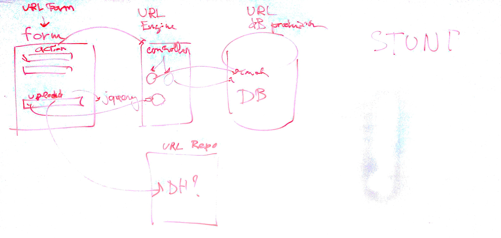

# Lezione di lunedì 11 gennaio 2016

* Analizzati i problemi derivanti dai vari providers di forms (`formkeep`,
  ecc.)
* Prototipazione di un dB via `host deployment` su `DreamHost`
* Inizio di realizzazione con `ruby on rails` di
  [`EMUForm`](https://github.com/SMERM/EMUForm)
